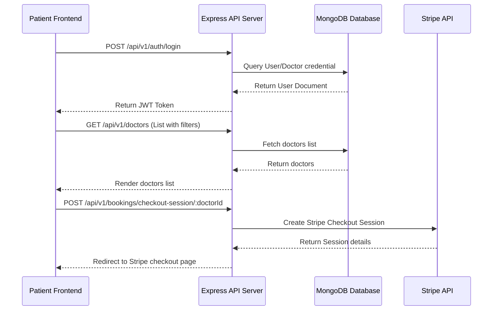
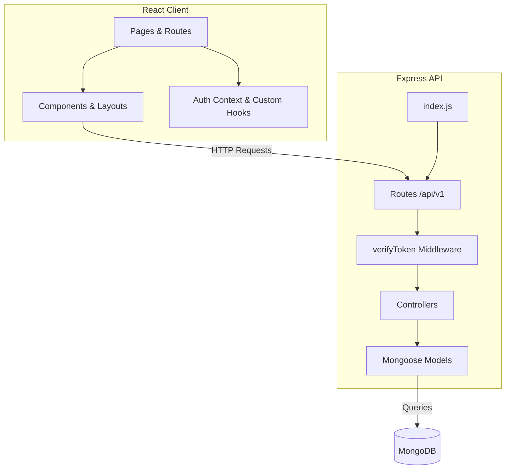

# SpeakEasy - Speech Language Therapy Clinical Services Platform

## Overview
SpeakEasy is a comprehensive healthcare platform designed to streamline and enhance speech-language therapy clinical services. It connects speech-language pathologists (therapists/doctors) and patients, offering an end-to-end workflow from search and appointment booking to payment processing, progress tracking, and secure communication. 

The platform helps:
- **Patients**: Find specialized therapists, book sessions, track therapy goals, and connect with therapists directly.
- **Therapists**: Manage patient slots, build custom profiles showcasing their qualifications/experience, track reviews, and manage booking pipelines.
- **Clinics/Admins**: Maintain user directories and oversee clinical operations.

---

## Features
- **Therapist Search & Filtering**: Dynamic search and filtering of doctors by name, specialization, or rating.
- **Appointment Booking & Payments**: Complete booking workflow integrated with **Stripe** for secure online payments.
- **Direct Therapist Communication**: Built-in messaging utilizing **EmailJS** and instant integration with **Google Meet** for video sessions.
- **Interactive Goal Tracker (Todo List)**: Dynamic therapy goal and activity tracker persisting state via LocalStorage.
- **Role-Based Authentication**: Secure JWT-based registration and login system with distinct user models and views for Patients, Doctors, and Admins.
- **User & Doctor Dashboards**: Customized workspaces for tracking appointments, updating profile details, and viewing feedback reviews.
- **Rating & Review System**: Patient reviews and ratings that dynamically calculate doctor profiles' average ratings.

---

## Tech Stack

### Frontend
- **Framework**: React 18 (Vite-based build system)
- **Styling**: Tailwind CSS, PostCSS
- **Routing**: React Router DOM (v6)
- **Libraries**: Swiper (for interactive sliders), React Icons, React Toastify (notifications)
- **Services**: EmailJS (email transmission), Stripe (payment gateway redirect)

### Backend
- **Framework**: Express.js (Node.js)
- **Database**: MongoDB via Mongoose ODM
- **Authentication**: JSON Web Tokens (JWT) & bcrypt password hashing
- **Middleware**: Cookie Parser, CORS, JSON Body Parser
- **Payments**: Stripe Node.js SDK

---

## Architecture

SpeakEasy follows a decoupled Client-Server architecture. The React frontend interacts with the RESTful Node/Express backend via HTTP/HTTPS.

### Data Flow & System Interactions



### Module Architecture



---

## Folder Structure

Below is the directory structure highlighting key folders and files:

```text
SpeakEasy/
├── backend/                  # Express REST API codebase
│   ├── auth/                 # JWT Authentication & authorization middleware
│   │   └── verifyToken.js    # Protects routes & handles role-based restriction
│   ├── Controllers/          # Business logic handlers for API routes
│   │   ├── authController.js
│   │   ├── bookingController.js
│   │   ├── doctorController.js
│   │   ├── reviewController.js
│   │   └── userController.js
│   ├── models/               # MongoDB Schemas & Mongoose Models
│   │   ├── BookingSchema.js
│   │   ├── DoctorSchema.js
│   │   ├── ReviewSchema.js
│   │   └── UserSchema.js
│   ├── Routes/               # Express endpoints router maps
│   ├── index.js              # Application entry point & server setup
│   └── package.json          # Backend dependencies
│
├── frontend/                 # React SPA (Vite) codebase
│   ├── public/               # Static assets & icons
│   ├── src/
│   │   ├── assets/           # Images, avatars, & styling resources
│   │   ├── components/       # Reusable layout and functional UI components
│   │   │   └── communication.jsx  # EmailJS & Google Meet integration component
│   │   ├── Dashboard/        # User and Doctor profile workspaces/dashboards
│   │   ├── hooks/            # Custom React hooks (e.g., fetch data)
│   │   ├── pages/            # View pages (Home, Login, Signup, Doctors, Todo)
│   │   ├── routes/           # Routing configuration & route protection guards
│   │   │   ├── Routers.jsx
│   │   │   └── ProtectedRoute.jsx
│   │   ├── App.jsx           # Root layout container
│   │   ├── index.css         # Custom typography and Tailwind styling root
│   │   └── main.jsx          # Vite React mounting script
│   └── package.json          # Frontend packages & script definitions
```

---

## Getting Started

### Prerequisites
- Node.js (v18 or higher recommended)
- MongoDB account or local instance running

### Installation

1. **Clone the Repository**
   ```bash
   git clone <repository-url>
   cd SpeakEasy
   ```

2. **Configure Environment Variables**

   - In `/backend/.env`:
     ```env
     PORT=8000
     MONGO_URL=your_mongodb_connection_string
     JWT_SECRET_KEY=your_jwt_secret
     STRIPE_SECRET_KEY=your_stripe_secret
     CLIENT_SITE_URL=http://localhost:5173
     ```
   
   - In `/frontend/.env.local`:
     ```env
     VITE_BACKEND_URL=http://localhost:8000/api/v1
     ```

3. **Install Dependencies**
   - **Backend**:
     ```bash
     cd backend
     npm install
     ```
   - **Frontend**:
     ```bash
     cd ../frontend
     npm install
     ```

### Run Locally

1. **Start Backend Server**:
   ```bash
   cd backend
   npm run start-dev
   ```

2. **Start Frontend Server**:
   ```bash
   cd frontend
   npm run dev
   ```

3. Open your browser and navigate to `http://localhost:5173`.
